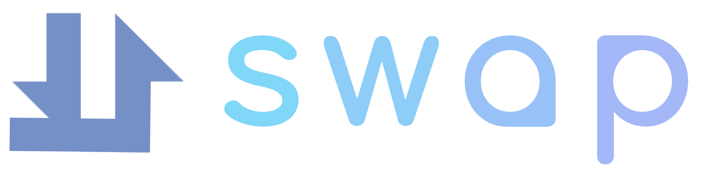

## U-swap is a platform to help students register for the courses they want but are currently full. U-swap finds students who want each-other's classes and connects them through online chat.

  
This project was bootstrapped with [Create React App](https://github.com/facebook/create-react-app).

### To run the project locally:
In the project directory, you can run:

## `npm install`
## `npm start`

Runs the app in the development mode.\
Open [http://localhost:3000](http://localhost:3000) to view it in your browser.

# View the project on Devpost 
(https://devpost.com/software/uswap?ref_content=my-projects-tab&ref_feature=my_projects)
